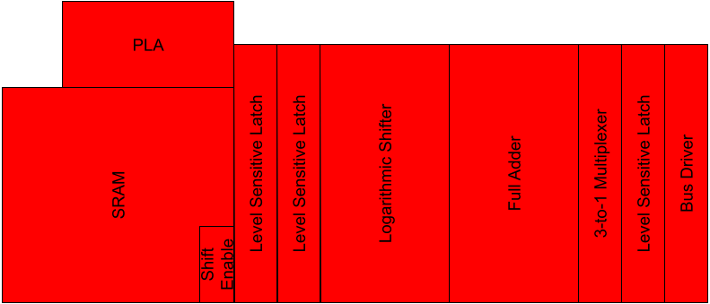
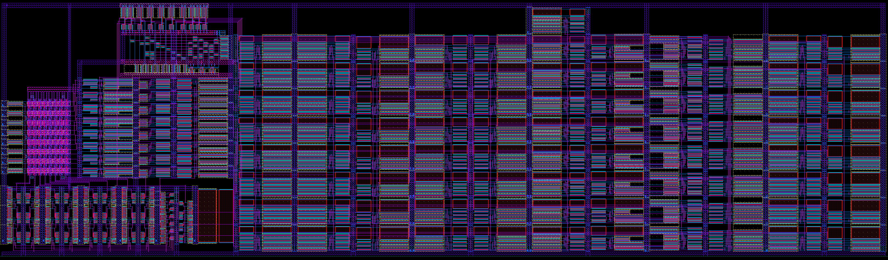

# 8-bit MicroController Core
## Arif Amzad

## About

## Op-Code
| Assembly | Instruction<0:2> | Description                       |
|----------|------------------|-----------------------------------|
| NOP      | 000              | Do Nothing                        |
| LOAD     | 001              | Mem[i]<-External Bus              |
| STORE    | 010              | External Bus<-Mem[i]              |
| GET      | 011              | Accumulator<-Mem[i]               |
| PUT      | 100              | Mem[i]<-Accumulator               |
| ADD      | 101              | Accumulator<-Accumulator+Mem[i]   |
| SUB      | 110              | Accumulator<-Accumulator-Mem[i]   |
| SHIFT    | 111              | Left logical shift of Accumulator |
## Schematic

## Floorplanning

## Layout

## Verification
